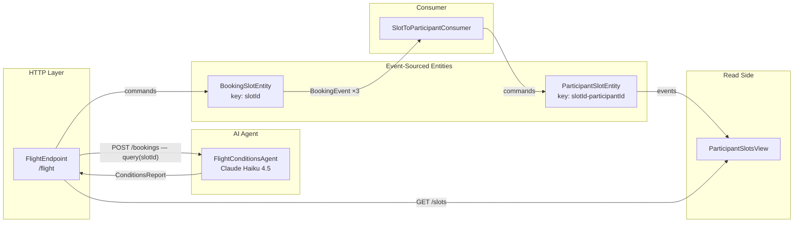
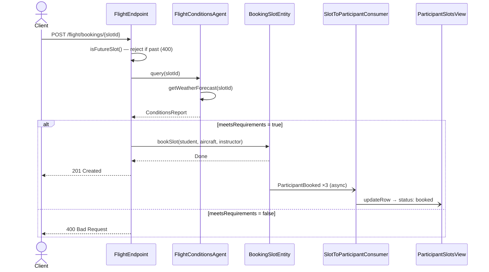

# Flight Training Scheduler — Akka Developer Certification

Backend for a flight training booking system built with **Akka SDK 3.5.6**. Implements event-sourced entities, a queryable view, an event-driven consumer pipeline, an AI agent for weather evaluation, and a reactive HTTP endpoint — following CQRS and the Akka SDK component model.

---

## Contents

| Section | What it covers |
|---|---|
| [Architecture](#architecture) | Event flow diagram, booking sequence, components table |
| [Implemented Components](#implemented-components) | Per-component description and commands |
| [HTTP API](#http-api) | Endpoints and status codes |
| [Run](#run) | Build and start the service |
| [Testing](#testing) | Unit tests and end-to-end guide |
| [SDK References](#sdk-references) | Official Akka SDK documentation |

**Project documentation**

| Document | Description |
|---|---|
| [Certification Requirements](docs/REFERENCE.md) | Original certification brief as provided by Akka |
| [Architecture & Design Decisions](docs/ARCHITECTURE.md) | Design rationale and key decisions per component |
| [End-to-End Testing Guide](docs/TESTING_GUIDE.md) | Full curl-based verification walkthrough (10 steps) |

---

## Architecture

### Event flow



### Booking sequence



### Akka SDK components

| Class | SDK Role | `@Component` id | Responsibility |
|---|---|---|---|
| `FlightEndpoint` | HTTP Endpoint | — | Public API; input validation; orchestrates agent + entity calls |
| `BookingSlotEntity` | Event-Sourced Entity | `booking-slot` | Primary aggregate per `slotId`; enforces all booking invariants |
| `ParticipantSlotEntity` | Event-Sourced Entity | `participant-slot` | Per `{slotId}-{participantId}`; tracks status for the read side |
| `SlotToParticipantConsumer` | Consumer | `booking-slot-consumer` | Bridges `BookingSlotEntity` events to `ParticipantSlotEntity` commands |
| `ParticipantSlotsView` | View | `view-participant-slots` | SQL-queryable projection; answers `GET /slots/{participantId}/{status}` |
| `FlightConditionsAgent` | Agent | `flight-conditions-agent` | LLM-based VFR conditions evaluator; uses `@FunctionTool` for weather data |

---

## Implemented Components

### BookingSlotEntity (Event-Sourced Entity)

Entity keyed by `slotId` (format `YYYY-MM-DD-HH`). Acts as the primary aggregate for a timeslot, enforcing all booking invariants.

Commands:
- `markSlotAvailable` — registers a participant's availability
- `unmarkSlotAvailable` — withdraws a participant's availability
- `bookSlot` — confirms a booking for student + aircraft + instructor; emits 3 `ParticipantBooked` events
- `cancelBooking` — cancels an existing booking; emits 3 `ParticipantCanceled` events
- `getSlot` — returns current timeslot state (read-only)

---

### ParticipantSlotEntity (Event-Sourced Entity)

Derived entity keyed by `{slotId}-{participantId}`. Tracks per-participant slot status (`available`, `booked`, `canceled`, `removed`). Maintained automatically by the consumer — no direct endpoint interaction.

---

### SlotToParticipantConsumer (Consumer)

Subscribes to `BookingSlotEntity` events and propagates them as commands to `ParticipantSlotEntity`. Decouples the booking aggregate from participant tracking via asynchronous, at-least-once delivery.

---

### ParticipantSlotsView (View)

Queryable read model backed by `ParticipantSlotEntity` events. Exposes `GET /flight/slots/{participantId}/{status}` for participant-centric queries across statuses: `available`, `booked`, `canceled`.

---

### FlightConditionsAgent (AI Agent)

AI agent that evaluates VFR flight conditions before approving a booking. Uses **Claude Haiku 4.5** via the Anthropic API. Calls the `getWeatherForecast` `@FunctionTool` with the slot ID, then evaluates results against minimum VFR criteria (visibility ≥ 3 mi, ceiling ≥ 1500 ft AGL, wind < 25 kts, no thunderstorms, no icing).

- Daytime slots (hour 06–18): clear skies → conditions approved
- Nighttime slots (hour outside 06–18): fog, low ceiling, high winds → conditions rejected

---

### FlightEndpoint (HTTP Endpoint)

Public RESTful API. All handlers return `CompletionStage<T>` — fully non-blocking. See [HTTP API](#http-api) below.

---

## HTTP API

| Method | Route | Description | Response |
|:-:|---|---|:-:|
| `POST` | `/flight/availability/{slotId}` | Mark participant availability | `200` |
| `DELETE` | `/flight/availability/{slotId}` | Unmark participant availability | `200` |
| `GET` | `/flight/availability/{slotId}` | Query slot internal state | `200` |
| `POST` | `/flight/bookings/{slotId}` | Create booking (with AI agent check) | `201` / `400` |
| `DELETE` | `/flight/bookings/{slotId}/{bookingId}` | Cancel booking | `200` |
| `GET` | `/flight/slots/{participantId}/{status}` | Query slots by participant and status | `200` |

`status` ∈ `available` | `booked` | `canceled`

---

## Run

Requires Java 21 and an active Anthropic API key.

```bash
export JAVA_HOME="$HOME/.sdkman/candidates/java/21.0.1-zulu"
export PATH="$JAVA_HOME/bin:$PATH"
export ANTHROPIC_API_KEY="your-api-key-here"

mvn compile && mvn exec:java
```

Expected output:
```
Akka Runtime started at 127.0.0.1:9000
```

---

## Testing

52 unit tests across 9 test classes — one per production file. Covers domain logic, entity state transitions, agent weather simulation, view row contracts, consumer key derivation, and endpoint validation.

```bash
export JAVA_HOME="$HOME/.sdkman/candidates/java/21.0.1-zulu"
export PATH="$JAVA_HOME/bin:$PATH"

mvn test
```

Expected: `Tests run: 52, Failures: 0, Errors: 0`

For the full end-to-end curl walkthrough (mark availability → bad conditions → successful booking → cancel → verify view), see [End-to-End Testing Guide](docs/TESTING_GUIDE.md).

---

## SDK References

- [Event-Sourced Entities](https://doc.akka.io/java/event-sourced-entities.html)
- [HTTP Endpoints](https://doc.akka.io/java/http-endpoints.html)
- [Views](https://doc.akka.io/java/views.html)
- [Consumers](https://doc.akka.io/sdk/consuming-producing.html)
- [Agents](https://doc.akka.io/java/agents.html)
- [Structured Agent Responses](https://doc.akka.io/sdk/agents/structured.html)
- [Anthropic Model Provider](https://doc.akka.io/sdk/model-provider-details.html)
